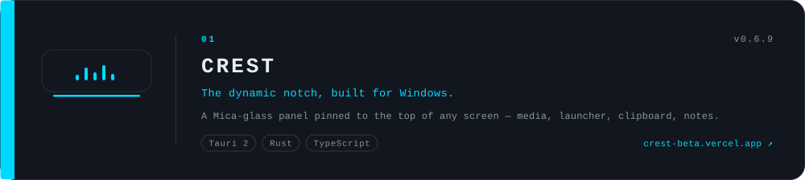
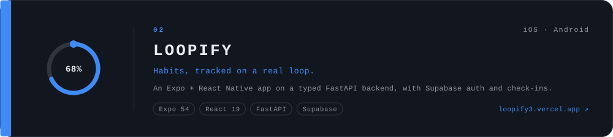
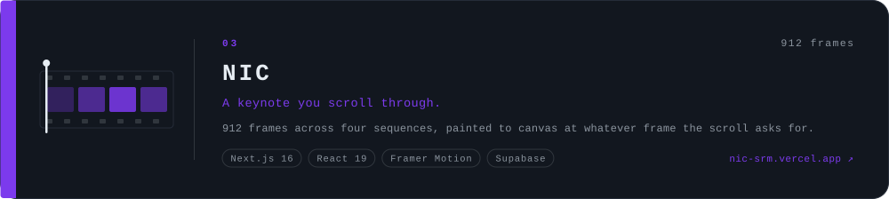
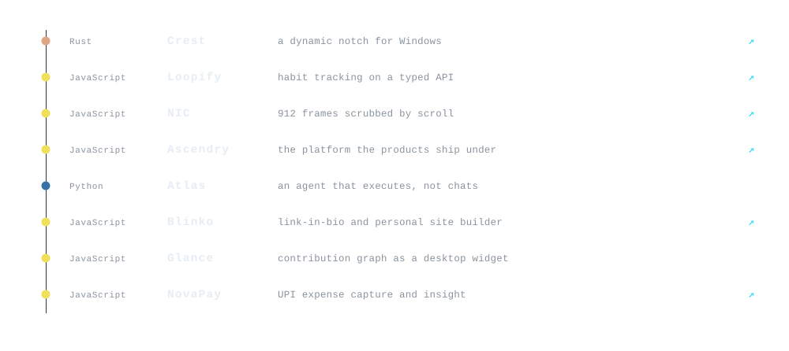

<div align="center">

<picture>
  <source media="(prefers-color-scheme: dark)" srcset="https://raw.githubusercontent.com/LennyDany-03/LennyDany-03/main/.github/assets/hero-dark.svg?v=2" />
  <source media="(prefers-color-scheme: light)" srcset="https://raw.githubusercontent.com/LennyDany-03/LennyDany-03/main/.github/assets/hero-light.svg?v=2" />
  
</picture>

<a href="https://github.com/LennyDany-03?tab=repositories"></a>
<a href="https://github.com/LennyDany-03?tab=followers"></a>
<a href="https://github.com/LennyDany-03/Dynamic-Notch/releases/latest"></a>

</div>

> [!NOTE]
> I started on the web and kept going down the stack. These days that means a **Rust/Tauri desktop app**,
> a **React Native product on a typed Python API**, and a **scroll-scrubbed canvas site**.
> Everything below links to something you can open and run.


## `$ ls ~/shipping`

<a href="https://github.com/LennyDany-03/Dynamic-Notch">
<picture>
  <source media="(prefers-color-scheme: dark)" srcset="https://raw.githubusercontent.com/LennyDany-03/LennyDany-03/main/.github/assets/card-crest-dark.svg?v=2" />
  <source media="(prefers-color-scheme: light)" srcset="https://raw.githubusercontent.com/LennyDany-03/LennyDany-03/main/.github/assets/card-crest-light.svg?v=2" />
  
</picture>
</a>

<a href="https://github.com/LennyDany-03/Loopify">
<picture>
  <source media="(prefers-color-scheme: dark)" srcset="https://raw.githubusercontent.com/LennyDany-03/LennyDany-03/main/.github/assets/card-loopify-dark.svg?v=2" />
  <source media="(prefers-color-scheme: light)" srcset="https://raw.githubusercontent.com/LennyDany-03/LennyDany-03/main/.github/assets/card-loopify-light.svg?v=2" />
  
</picture>
</a>

<a href="https://github.com/LennyDany-03/NIC-Website">
<picture>
  <source media="(prefers-color-scheme: dark)" srcset="https://raw.githubusercontent.com/LennyDany-03/LennyDany-03/main/.github/assets/card-nic-dark.svg?v=2" />
  <source media="(prefers-color-scheme: light)" srcset="https://raw.githubusercontent.com/LennyDany-03/LennyDany-03/main/.github/assets/card-nic-light.svg?v=2" />
  
</picture>
</a>

<div align="center">
<sub>

**Crest** &nbsp;[repo](https://github.com/LennyDany-03/Dynamic-Notch) · [download](https://github.com/LennyDany-03/Dynamic-Notch/releases/latest) · [site](https://crest-beta.vercel.app) &nbsp;&nbsp;|&nbsp;&nbsp;
**Loopify** &nbsp;[repo](https://github.com/LennyDany-03/Loopify) · [site](https://loopify3.vercel.app) &nbsp;&nbsp;|&nbsp;&nbsp;
**NIC** &nbsp;[repo](https://github.com/LennyDany-03/NIC-Website) · [site](https://nic-srm.vercel.app)

</sub>
</div>


## `$ cat stack`

<div align="center">

<picture>
  <source media="(prefers-color-scheme: dark)" srcset="https://raw.githubusercontent.com/LennyDany-03/LennyDany-03/main/.github/assets/stack-dark.svg?v=2" />
  <source media="(prefers-color-scheme: light)" srcset="https://raw.githubusercontent.com/LennyDany-03/LennyDany-03/main/.github/assets/stack-light.svg?v=2" />
  
</picture>

</div>


## `$ git log --oneline --author=lenny`

<picture>
  <source media="(prefers-color-scheme: dark)" srcset="https://raw.githubusercontent.com/LennyDany-03/LennyDany-03/main/.github/assets/ledger-dark.svg?v=2" />
  <source media="(prefers-color-scheme: light)" srcset="https://raw.githubusercontent.com/LennyDany-03/LennyDany-03/main/.github/assets/ledger-light.svg?v=2" />
  
</picture>

<div align="center">
<sub>

[Crest](https://github.com/LennyDany-03/Dynamic-Notch) ·
[Loopify](https://github.com/LennyDany-03/Loopify) ·
[NIC](https://github.com/LennyDany-03/NIC-Website) ·
[Ascendry](https://github.com/LennyDany-03/Ascendry) ·
[Atlas](https://github.com/LennyDany-03/Atlas) ·
[Blinko](https://github.com/LennyDany-03/Blinko) ·
[Glance](https://github.com/LennyDany-03/Glance-GitHub-Contribution-Widget) ·
[NovaPay](https://github.com/LennyDany-03/NovaPay)

</sub>
</div>

<details>
<summary><b><code>$ ls ~/client-work</code></b> &nbsp;— sites built for real people and organisations</summary>

<br/>

| project | for | live |
|:--|:--|:-:|
| [heatwave-website](https://github.com/LennyDany-03/heatwave-website) | Heatwave, Chennai | [↗](https://heatwave-chn.vercel.app) |
| [bexra-frontend](https://github.com/LennyDany-03/bexra-frontend) | Bexra | [↗](https://bexra.vercel.app) |
| [nukepc_career](https://github.com/LennyDany-03/nukepc_career) | NukePC — careers | [↗](https://nukepc-career.vercel.app) |
| [Bluefish-Consultancy](https://github.com/LennyDany-03/Bluefish-Consultancy) | Bluefish Consultancy | [↗](https://bluefish-consultancy.vercel.app) |
| [AMG_Gowtham_Portfolio](https://github.com/LennyDany-03/AMG_Gowtham_Portfolio) | A. M. G. Gowtham | — |
| [Dr. Dhiyanesh B. Portfolio](https://github.com/LennyDany-03/Dr.-Dhiyanesh-Balasubramanian-Portfolio) | Dr. Dhiyanesh Balasubramanian | [↗](https://dr-dhiyanesh-balasubramanian.vercel.app) |
| [Portfolio](https://github.com/LennyDany-03/Portfolio) | mine | [↗](https://lenny3.vercel.app) |

</details>

<details>
<summary><b><code>$ ls ~/hackathons</code></b> &nbsp;— built against a clock</summary>

<br/>

| event / build | live |
|:--|:-:|
| [HackElite](https://github.com/LennyDany-03/HackElite) | [↗](https://hack-elite-rho.vercel.app) |
| [Hackstronauts](https://github.com/LennyDany-03/Hackstronauts) | [↗](https://hackstronauts.vercel.app) |
| [Lakshya](https://github.com/LennyDany-03/Lakshya) | [↗](https://lakshya-sand.vercel.app) |
| [App-ocalypse](https://github.com/LennyDany-03/App-ocalypse) | [↗](https://app-ocalypse.vercel.app) |
| [GameAThon 2025 — 4 Direction](https://github.com/LennyDany-03/GameAThon-2025-4-Direction) | [↗](https://game-a-thon-2025-4-direction.vercel.app) |
| [Navonmesa — Time Travel Debug](https://github.com/LennyDany-03/Navonmesa-Time-Travel-Debug) | — |
| [Ace-Hack](https://github.com/LennyDany-03/Ace-Hack) | — |

</details>

<details>
<summary><b><code>$ ls ~/labs</code></b> &nbsp;— coursework, experiments and things I broke on purpose</summary>

<br/>

**AI / ML**
[Chatbot-Using-Groq](https://github.com/LennyDany-03/Chatbot-Using-Groq) ·
[image-recognition-dip](https://github.com/LennyDany-03/image-recognition-dip) ·
[Digital-Image-Processing-Lab](https://github.com/LennyDany-03/Digital-Image-Processing-Lab) ·
[Testing-Media-Bot](https://github.com/LennyDany-03/Testing-Media-Bot) ·
[Numpy](https://github.com/LennyDany-03/Numpy)

**Full-stack products**
[Flux](https://github.com/LennyDany-03/Flux) + [Flux_Backend](https://github.com/LennyDany-03/Flux_Backend) ·
[IELTS-Project](https://github.com/LennyDany-03/IELTS-Project) + [IELTS-Backend](https://github.com/LennyDany-03/IELTS-Backend) ·
[TravelWise](https://github.com/LennyDany-03/TravelWise) ·
[Urban-Haven](https://github.com/LennyDany-03/Urban-Haven) ·
[EmpowerTech](https://github.com/LennyDany-03/EmpowerTech) ·
[Donation](https://github.com/LennyDany-03/Donation) ·
[shareme](https://github.com/LennyDany-03/shareme_frontend)

**Databases & systems**
[Hershly-DBMS](https://github.com/LennyDany-03/Hershly-DBMS) ·
[Hospital-Management-DBMS](https://github.com/LennyDany-03/Hospital-Management-DBMS-) ·
[Bank-System](https://github.com/LennyDany-03/Bank-System-simple-) ·
[Chennai-Metro](https://github.com/LennyDany-03/Chennai-Metro)

**Reusable pieces**
[NextJS-Supabase-Auth-Template](https://github.com/LennyDany-03/NextJS-Supabase-Auth-Template) ·
[QR-Code-Reader](https://github.com/LennyDany-03/QR-Code-Reader) ·
[localPreview](https://github.com/LennyDany-03/localPreview)

</details>


## `$ gh api /signals`

<picture>
  <source media="(prefers-color-scheme: dark)" srcset="https://raw.githubusercontent.com/LennyDany-03/LennyDany-03/main/.github/assets/signals-dark.svg?v=2" />
  <source media="(prefers-color-scheme: light)" srcset="https://raw.githubusercontent.com/LennyDany-03/LennyDany-03/main/.github/assets/signals-light.svg?v=2" />
  
</picture>

<div align="center">
<sub>Numbers pulled straight from the GitHub API and redrawn every Monday — see <a href="https://github.com/LennyDany-03/LennyDany-03/blob/main/.github/workflows/assets.yml"><code>assets.yml</code></a>.</sub>
</div>


## `$ cat roadmap.2026`

```
[ ██████████████░░░░░░ ]  70%   Crest -> 1.0 stable, on more desktops
[ ████████████░░░░░░░░ ]  60%   Loopify off prototype data, onto the live API
[ ██████████░░░░░░░░░░ ]  50%   Ascendry v1, open to the public
[ ██████░░░░░░░░░░░░░░ ]  30%   Atlas: an agent that finishes the task
[ ████░░░░░░░░░░░░░░░░ ]  20%   ML/AI from first principles, no wrappers
```

> [!TIP]
> Crest runs on any Windows 10/11 machine — you do not need a laptop with a notch.
> **[Grab the installer →](https://github.com/LennyDany-03/Dynamic-Notch/releases/latest)**


## `$ curl -X CONNECT lenny`

<div align="center">

[](https://www.linkedin.com/in/lenny-dany-derek-d-4411aa326)
[](https://lenny3.vercel.app)
[](https://ascendry.vercel.app)
[](https://www.instagram.com/lenny_dany_3/)
[](mailto:lennydany3@gmail.com)

</div>

<picture>
  <source media="(prefers-color-scheme: dark)" srcset="https://raw.githubusercontent.com/LennyDany-03/LennyDany-03/main/.github/assets/footer-dark.svg?v=2" />
  <source media="(prefers-color-scheme: light)" srcset="https://raw.githubusercontent.com/LennyDany-03/LennyDany-03/main/.github/assets/footer-light.svg?v=2" />
  
</picture>

<div align="center">
<sub>Every graphic on this page is hand-drawn SVG, generated from
<a href="https://github.com/LennyDany-03/LennyDany-03/blob/main/.github/assets/generate.py"><code>.github/assets/generate.py</code></a> —
edit a token, re-run, done.</sub>
</div>
